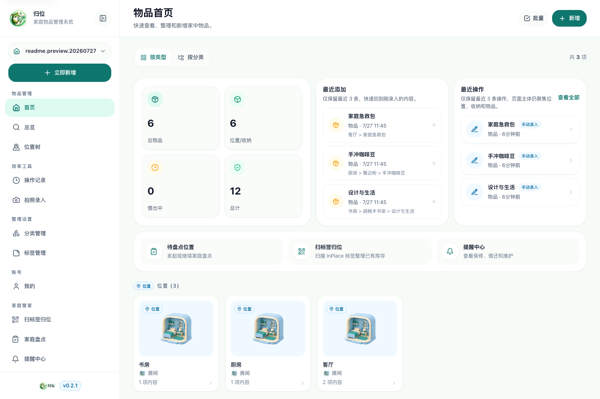
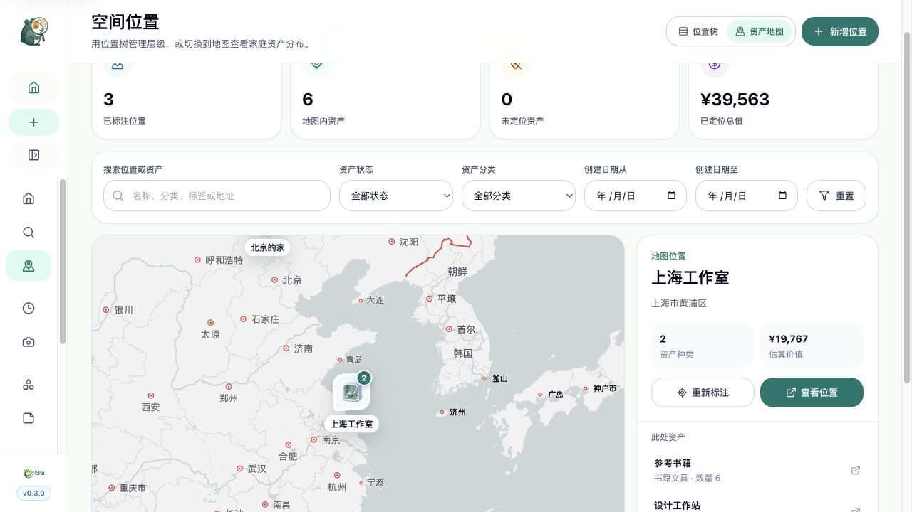
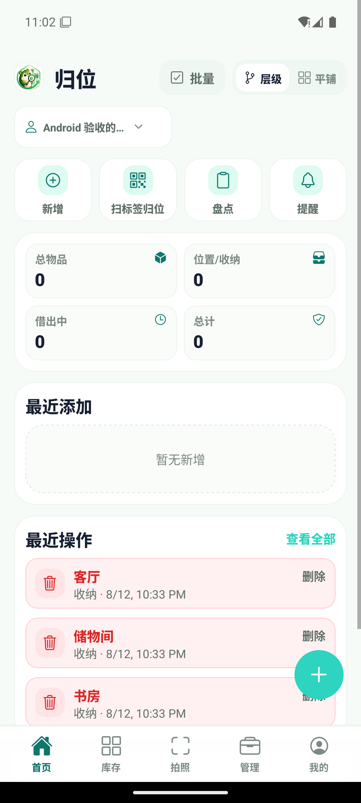

# InPlace

<p align="center">
  
</p>

[English version](README.md)

InPlace 是一个开源的家庭物品管理项目，用于记录家中有哪些物品、放在哪里、如何分类和追踪变更。项目采用 TypeScript monorepo 组织，包含 React Web 应用、Expo 移动端应用、Fastify API 和 PostgreSQL 数据层。

代码仍在持续演进，但当前方向已经明确：客户端通过 API 访问业务能力，API 负责校验和持久化访问，PostgreSQL 作为系统主数据源。

<p align="center">
  
</p>

<p align="center"><sub>Web 首页 · 库存概览、最近动态与位置收纳</sub></p>

## 功能特性

- 物品、分类、位置、标签和操作记录管理。
- 基于 React、Vite 和共享领域包的 Web 客户端。
- 基于 Expo 和 React Native 的移动端客户端。
- 基于 Fastify 的 API 服务，使用 PostgreSQL 和 Drizzle ORM。
- 支持图片上传，并预留服务端 AI 识别能力。
- 支持 JSON、CSV 导出，移动端支持 JSON 备份导入。
- 支持真实地理资产地图，可按位置展示图标、聚合标记、筛选资产并标注坐标。
- 支持拆分服务和一体化两种 Docker Compose 部署方式。

## 地理资产地图

Web 端会把嵌套资产投影到最近的已标注位置，在保留原有“位置—收纳—物品”层级的同时，直观展示家庭资产的地理分布。

<p align="center">
  
</p>

<p align="center"><sub>地理资产地图 · 位置分类图标、筛选、汇总统计与资产下钻</sub></p>

- 通过同源服务端代理加载真实高德 Web JS 地图，配套安全密钥不会下发到浏览器。
- 地图标记展示对应最外层位置分类的图标，并自动聚合相邻位置。
- 支持按关键词、资产状态、资产分类和创建日期筛选。
- 展示已标注/未定位统计、位置估值汇总以及选中位置下的资产明细。
- 家庭所有者和编辑者可以首次标注或重新设置坐标，查看者保持只读权限。

地图能力为可选配置。所需的高德 Web端（JS API）Key、安全密钥及生产域名白名单配置见[部署](#部署)。

## 仓库结构

```text
.
├── apps
│   ├── mobile      # Expo / React Native 应用
│   ├── server      # Fastify API
│   └── web         # React + Vite Web 应用
├── packages
│   ├── api-client  # 共享 API 客户端辅助能力
│   ├── app-core    # 跨客户端应用逻辑
│   ├── db          # Drizzle schema、数据库客户端和迁移
│   ├── domain      # 共享领域类型和规则
│   └── ui          # 共享设计 token 和 UI 基础能力
├── docs            # 架构说明与历史资料
├── infra           # 本地基础设施，包括 PostgreSQL
├── docker-compose.yml
├── docker-compose.single.yml
└── package.json
```

## 架构说明

InPlace 按清晰的职责边界组织：

- `apps/web` 和 `apps/mobile` 负责用户界面。
- `apps/server` 暴露 API 路由，负责输入校验、业务编排和持久化访问。
- `packages/db` 维护 PostgreSQL schema 和迁移工具。
- `packages/domain`、`packages/app-core`、`packages/api-client`、`packages/ui` 在多个客户端之间复用领域、应用和 UI 能力。

新的数据访问逻辑应优先通过 API 实现，不应继续在前端客户端中新增直接数据库访问或 legacy 数据源访问。

更多背景见 [docs/architecture/target-architecture.md](docs/architecture/target-architecture.md)。

## 工程与产品文档

- [Web UI 与地图功能设计基线](docs/product/web-ui-functional-design.md)：信息架构、交互契约、地图行为、已知 UX 风险和排障入口。
- [工程 Harness](docs/harness/README.md)：变更协议、质量规则、测试矩阵、现有 CI 门禁、任务路由和 PR 模板。
- [贡献指南](CONTRIBUTING.md)：本地开发和协作基础。

## 环境要求

- Node.js `>= 20.10.0`
- npm `>= 10`
- Docker Desktop 或兼容的 Docker 运行时
- 开发移动端时需要 Expo 相关工具链

## 快速开始

安装依赖：

```bash
npm install
```

启动本地 PostgreSQL：

```bash
npm run db:up
```

创建本地环境变量文件：

```bash
cp apps/server/.env.example apps/server/.env
cp apps/web/.env.example apps/web/.env
```

分别在两个终端中启动 API 和 Web：

```bash
npm run dev:server
```

```bash
npm run dev:web
```

启动移动端：

```bash
npm run dev:mobile
```

如需运行原生移动端构建：

```bash
npm run android
npm run ios
```

## 部署

仓库支持两种 Docker Compose 部署方式。

### 拆分服务部署

[docker-compose.yml](docker-compose.yml) 会以独立服务运行 PostgreSQL、Fastify API 和 Web 前端。希望服务边界清晰、方便独立管理生命周期时，建议使用这种方式。

准备环境变量：

```bash
cp .env.compose.example .env.compose
```

首次启动前至少需要修改这些值：

```env
POSTGRES_PASSWORD=<设置强密码>
# 生成两个不同的密钥（例如执行 openssl rand -hex 32）。
JWT_SECRET=
APP_ENCRYPTION_KEY=
CORS_ORIGIN=https://your-domain.com,http://localhost:8080,http://127.0.0.1:8080
PUBLIC_ORIGIN=https://your-domain.com
AI_PROVIDER_ALLOWED_BASE_URLS=https://api.openai.com/v1
VITE_API_BASE_URL=/api
BACKUP_PAYLOAD_SIZE_MB=100
# 可选：启用真实资产地图，必须成对配置。
AMAP_JS_API_KEY=<高德 Web端（JS API）Key>
AMAP_JS_SECURITY_CODE=<对应的安全密钥>
```

启动服务：

```bash
docker compose --env-file .env.compose up -d server web
```

浏览器访问：

```text
http://localhost:8080
```

`server` 容器会在 API 启动前自动执行已纳入版本控制的数据库迁移，因此首次启动和后续更新都可以复用同一条命令。

### 一体化部署

[docker-compose.single.yml](docker-compose.single.yml) 会把 PostgreSQL、API 和 Nginx 托管的前端静态资源打包进一个容器，适合简单的单机自部署场景。

准备环境变量：

```bash
cp .env.single.example .env.single
```

启动一体化容器：

```bash
docker compose --env-file .env.single -f docker-compose.single.yml up -d
```

一体化镜像发布地址：

```text
ghcr.io/sakurasm/inplace-all-in-one:latest
```

## 部署运维

拉取镜像：

```bash
docker compose --env-file .env.compose pull
```

查看容器状态：

```bash
docker compose --env-file .env.compose ps
```

查看日志：

```bash
docker compose --env-file .env.compose logs -f
```

通过 Web 入口检查 API 健康状态：

```text
http://localhost:8080/api/v1/health
```

停止拆分服务部署：

```bash
docker compose --env-file .env.compose down
```

如果希望把 PostgreSQL 数据放到指定宿主机路径，请在启动 Compose 前设置 `POSTGRES_DATA_DIR`：

```env
POSTGRES_DATA_DIR=/Volumes/data/inplace/postgres
```

默认情况下，Compose 会把 PostgreSQL 数据保存到 `./storage/postgres`。

## 环境变量

### API

参考 [apps/server/.env.example](apps/server/.env.example)。

主要变量：

- `PORT`：API 端口。
- `DATABASE_URL`：PostgreSQL 连接串。
- `CORS_ORIGIN`：允许访问 API 的前端来源。
- `PUBLIC_ORIGIN`：生产环境公开访问地址，用于生成可信绝对 URL；生产环境必填。
- `JWT_SECRET`：JWT 签名密钥，建议使用至少 32 位随机字符串。
- `APP_ENCRYPTION_KEY`：用户保存的 AI 凭据加密密钥，生产环境请使用独立密钥。
- `MAX_UPLOAD_SIZE_MB`：单张图片最大上传大小。
- `BACKUP_PAYLOAD_SIZE_MB`：备份导入最大请求体大小。
- `OPENAI_API_KEY`：服务端 AI 识别使用的可选默认 API Key。
- `OPENAI_BASE_URL`：AI 服务基础地址，默认 `https://api.openai.com/v1`。
- `AI_PROVIDER_ALLOWED_BASE_URLS`：允许使用的 HTTPS AI Provider 地址列表，逗号分隔。
- `AI_REQUEST_TIMEOUT_MS` / `AI_MAX_RESPONSE_BYTES`：AI 请求超时和响应大小上限。
- `AUTH_SESSION_TTL_DAYS`：可撤销登录会话的有效天数，默认 7 天。
- `OPENAI_MODEL`：AI 图片识别使用的模型名。
- `AMAP_JS_API_KEY`：高德开放平台的 Web端（JS API）Key，用于启用真实资产地图。
- `AMAP_JS_SECURITY_CODE`：与上述 Key 配套的安全密钥。该值仅由服务端代理使用，不会下发到浏览器；两个变量必须同时配置。

个人中心保存的 AI 配置会在服务端加密保存。前端不会回显明文 Key；自定义 Provider 必须位于运维允许列表并配置独立 API Key，不能复用服务端默认 Key。

启用资产地图时，还应在高德控制台为 Web Key 配置生产域名白名单。不要把安全密钥写入 `VITE_*` 变量、前端源码或提交到仓库。地图坐标保存在家庭位置的 `metadata.geo_location` 中，无需数据库迁移。

### Web

参考 [apps/web/.env.example](apps/web/.env.example)。

主要变量：

- `VITE_API_BASE_URL`：API 基础地址。

在旧数据访问路径完全退场前，前端示例文件中可能仍保留少量 legacy 迁移变量。

### 移动端

移动端应用位于 [apps/mobile](apps/mobile)，与 Web 共用同一套 API、domain 和 app-core 包。

主要变量：

- `EXPO_PUBLIC_API_BASE_URL`：用户在 App 内配置服务器前使用的默认 API 地址。
- `EXPO_PUBLIC_WEB_BASE_URL`：仅用于调试的地图画布 Web 地址；生产环境从 API Origin 自动推导。
- `EXPO_PROJECT_ID`：GitHub Actions 中用于 EAS Build 的仓库变量。
- `EXPO_TOKEN`：GitHub Actions 中用于 EAS Build 的密钥。

首次登录或注册时，在 App 内输入服务器地址和账号密码。App 会把服务器地址规范化到 `/api`，在设备端保存服务器配置，并使用安全存储保存认证令牌。生产版移动端仅接受 HTTPS 服务器；HTTP 仅用于 debug 开发构建。

Android 通过原生页面覆盖 Web 的主要库存工作流，底部导航固定为“首页 / 库存 / 拍照 / 管理 / 我的”。位置页提供位置树与地图双视图；只有高德地图画布运行在受限 WebView 中，筛选、家庭权限、详情和坐标确认仍由原生层负责。高德安全密钥不会下发到 App。



能力矩阵、地图桥接安全边界、本地实时预览和排障步骤见 [Android/Web 对齐说明](docs/product/android-web-parity.md)。

## 开发脚本

在仓库根目录执行：

```bash
npm run dev:web
npm run dev:server
npm run dev:mobile
npm run android
npm run ios
npm run build
npm run build:web
npm run build:server
npm run build:mobile
npm run lint
npm run typecheck
npm run db:up
npm run db:down
npm run db:logs
npm run db:generate
npm run db:migrate
npm run compose:pull
npm run compose:up
npm run compose:down
npm run compose:logs
npm run single:pull
npm run single:up
npm run single:down
npm run single:logs
```

## 数据库开发

生成迁移：

```bash
npm run db:generate
```

执行迁移：

```bash
npm run db:migrate
```

本地 PostgreSQL 配置位于 [infra/postgres/docker-compose.yml](infra/postgres/docker-compose.yml)。已纳入版本控制的 SQL 迁移位于 [packages/db/migrations](packages/db/migrations)，运行时迁移执行器位于 [packages/db/scripts/migrate.ts](packages/db/scripts/migrate.ts)。

## 当前状态

项目已经完成 workspaces、独立 API、共享数据库包和本地 PostgreSQL 运行环境等结构性迁移。迁移期间仍可能存在少量 legacy 前端数据访问路径；新功能应优先采用 API-backed 流程。

旧的 Supabase SQL 资料仅作为历史参考保留在 [docs/legacy/supabase](docs/legacy/supabase)。

## 参与贡献

欢迎参与贡献。提交 PR 前请先阅读 [CONTRIBUTING.md](CONTRIBUTING.md)，并遵循项目的 [Code of Conduct](CODE_OF_CONDUCT.md)。

提交前请运行：

```bash
npm run typecheck
npm run build
```

如果改动只影响某个 app 或 package，也建议同时运行对应 workspace 的检查脚本。

请不要提交密钥、生产凭据或本地环境变量文件。仓库中的 `.env*.example` 文件仅作为配置模板使用。

## 路线图

- 将剩余 legacy 前端数据访问替换为 API 客户端。
- 强化服务端领域服务与仓储边界。
- 为 API、数据库、Web 和移动端流程补充自动化测试。
- 完善发布和自部署文档。

## 许可证

本项目基于 Apache License 2.0 发布，详见 [LICENSE](LICENSE)。
