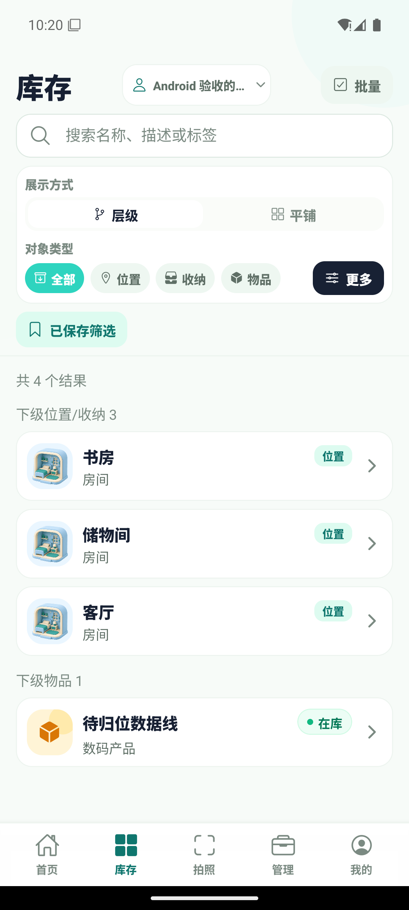
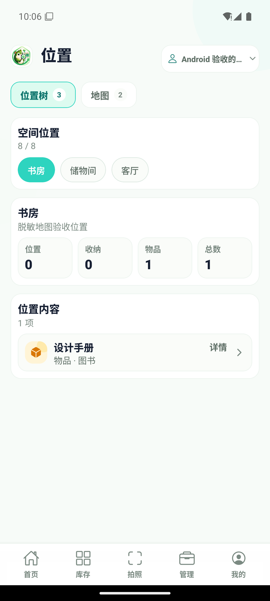
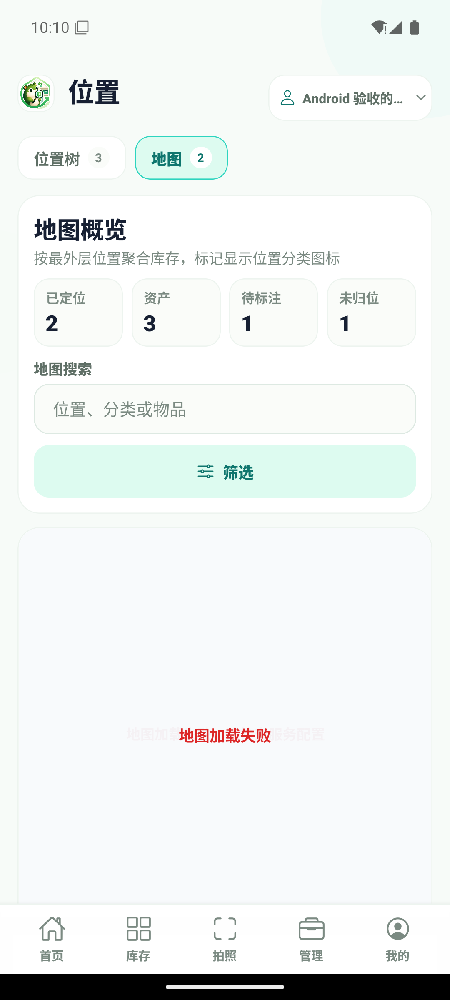
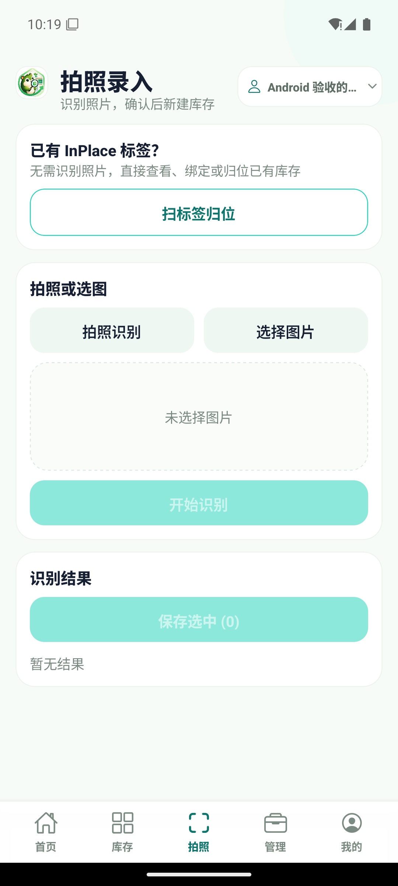
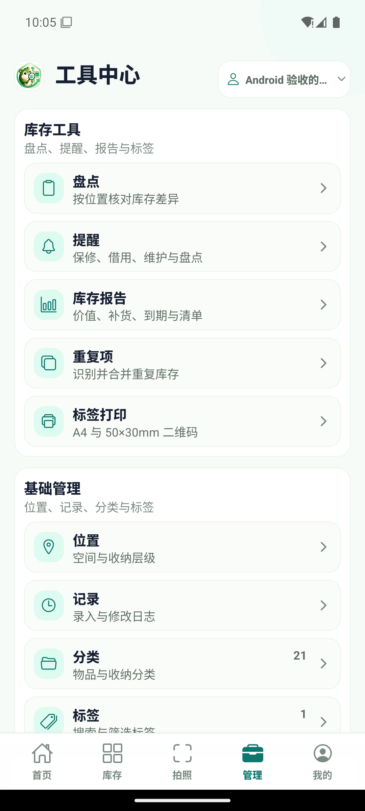

# Android / Web 能力与交互对齐

本文记录 Android 与 Web 的当前能力边界、地图桥接、安全约束和验收路径，供开发、CR 和线上排障使用。Android 不机械复刻桌面布局，而是保持相同业务结果并使用原生触控、返回键、底部导航、Sheet 和表单交互。

## 信息架构

Android 主导航固定为：

1. 首页：统计、最近动态、快捷任务、批量操作和新增。
2. 库存：搜索、组合筛选、保存筛选、分页结果和统一下钻。
3. 拍照：拍照/相册识别、多结果编辑保存，以及扫码归位入口。
4. 管理：位置、盘点、提醒、报告、重复项、标签打印、操作记录、分类与标签。
5. 我的：资料、家庭与成员、AI、安全、数据和关于。

位置和操作记录属于低频能力，从管理中心进入。所有主页面展示当前家庭入口；切换后移动端请求携带新的 `X-InPlace-Household-ID`，家庭级查询失效并重新获取。

页面背景保持克制：主导航页只保留极弱的右上品牌色氛围，子页面使用纯色画布，不再叠加左右边缘光晕。所有子页面通过共享 `PageHeader` 提供返回、标题和说明，并由 `Screen` 统一叠加顶部/底部 Safe Area，避免刘海、状态栏和手势区遮挡。

## 能力矩阵

| 能力域 | Web | Android | Android 交互 |
| --- | --- | --- | --- |
| 首页 | 统计、分组、动态、批量、新增 | 已对齐 | 原生滚动、悬浮新增、底部批量栏 |
| 库存 | 搜索、类型/状态/标签/位置、保存筛选、分页 | 已对齐 | 原生筛选 Sheet、触控列表与下钻 |
| 位置 | 位置树、地图、层级统计、内容浏览 | 已对齐 | 位置树/地图页签；画布外 UI 全原生 |
| 详情/表单 | 图片、分类、标签、数量、价格、日期、追踪、位置、附件、生命周期 | 已对齐 | 原生表单、选择 Sheet、确认弹窗 |
| 拍照/扫码 | 识别、编辑保存、标签绑定与归位 | 已对齐 | 原生相机/相册/扫码权限与预览 |
| 管理工具 | 盘点、提醒、报告、重复项、打印、记录、分类、标签 | 已对齐 | 管理中心分组入口 |
| 账户/家庭 | 资料、家庭成员与邀请、AI、安全、数据、关于 | 已对齐 | 当前家庭入口；角色决定编辑入口 |

## Pixel 8 脱敏验收截图

截图使用隔离测试家庭和虚构地址，不包含真实库存或家庭位置。

| 首页 | 库存 | 位置树 |
| --- | --- | --- |
|  |  |  |

| 地图错误态 | 拍照录入 | 管理中心 |
| --- | --- | --- |
|  |  |  |

地图截图为模拟器 DNS 无法解析高德公共域名时的明确错误态；不作为 Key 失效证据。在 DNS 正常设备上仍需复验真实瓦片、MarkerCluster 与逆地理编码。

查看者只展示浏览入口；owner/editor 可编辑。客户端隐藏操作只用于交互防误触，服务端 `requireHouseholdAccess` 始终是最终权限边界。

## 地图桥接

地图统计口径位于 `@inplace/app-core`：

- `asset-map.ts`：层级投影、最外层位置、聚合统计。
- `geo-asset-map.ts`：坐标读取、筛选、未定位/未归位统计和 metadata 合并。
- `mobile-map-bridge.ts`：最小地图 DTO 与双向判别联合消息。
- `maps.ts`：公开地图配置 API 契约。

Web 的公开 `/mobile-map` 只承载高德画布，不拉取认证库存。Android 原生层生成 `MobileMapPoint` 后发送给 WebView；字段仅包含点位 ID、位置名、分类展示、经纬度和资产数量，不包含 Token、安全密钥、完整库存或家庭地址列表。

Native → Web：初始化、点位更新、选择状态、坐标标注模式。Web → Native：ready、点位选择、坐标选择、加载/交互错误。两端都在使用消息前做运行时结构校验；Android 只允许 WebView 导航到配置 Origin 的 `/mobile-map`，禁止任意外链与新窗口。

Marker 使用对应最外层位置分类图标、资产数量和位置名称；相邻点由高德 MarkerCluster 聚合。坐标点击先由高德逆地理编码，再由原生确认弹窗保存至 `metadata.geo_location`，更新函数保留其他 metadata 字段。

## Key 与安全边界

- 继续使用 `AMAP_JS_API_KEY`，类型为“Web端（JS API）Key”。
- `AMAP_JS_SECURITY_CODE` 只存在于 Server 环境，供同源代理使用。
- `/api/v1/maps/config` 只返回启用状态、公开 Web Key 与代理路径，保持原有响应兼容。
- Android 不使用高德原生 SDK，不需要 Android Key、SHA1 或包名绑定。
- `.env.compose`、临时 Compose override、真实地址、库存和 Key 不进入 Git、日志、文档或截图。

## Android 本地实时预览

使用 Node 20。Docker Server 的生产校验要求非占位的独立 `JWT_SECRET` 与 `APP_ENCRYPTION_KEY`；本地覆盖只应放在 `/tmp`，不能提交。

```bash
docker compose --env-file .env.compose --env-file /tmp/inplace-compose.dev.env \
  -f docker-compose.yml -f /tmp/inplace-compose.dev.yml \
  up -d postgres server web

adb reverse tcp:8080 tcp:8080
adb reverse tcp:8081 tcp:8081
adb reverse tcp:5173 tcp:5173

VITE_API_BASE_URL=http://localhost:8080/api \
  npm run dev --workspace @inplace/web -- --host 127.0.0.1 --port 5173

EXPO_PUBLIC_API_BASE_URL=http://localhost:8080/api \
EXPO_PUBLIC_WEB_BASE_URL=http://localhost:5173 \
  npx expo run:android --variant debug --port 8081
```

安装 `react-native-webview` 后必须重建一次原生调试包；后续 JavaScript/TypeScript 改动可使用 Fast Refresh。登录服务器统一填写 `http://localhost:8080/api`。

启动后检查：

```bash
curl -f http://localhost:8080/healthz
curl -f http://localhost:8080/api/v1/health
curl -f http://localhost:8080/api/v1/maps/config
```

不要在终端输出第三个接口的真实 Key。

## 排障

| 现象 | 优先检查 | 说明 |
| --- | --- | --- |
| `USERKEY_PLAT_NOMATCH` | 实际 WebView Origin、Key 服务类型、域名白名单和安全代理 | 不能仅凭错误码断言 Key 内容错误 |
| 地图配置 200 但 SDK 超时 | 模拟器 DNS、`webapi.amap.com` 连通性、高德脚本和代理 | 若 `adb shell ping webapi.amap.com` 为 unknown host，属于设备 DNS，不是 Key 校验结果 |
| `/mobile-map` 404 | `EXPO_PUBLIC_WEB_BASE_URL` 是否指向包含该路由的 Web 构建 | Docker 旧镜像不会包含本地未发布代码 |
| WebView 拦截页面 | 导航目标是否仍是同 Origin 的 `/mobile-map` | 任意其他路径和外域按安全策略拒绝 |
| 统计有点位但无 Marker | 坐标是否合法、分类映射、SDK/MarkerCluster 是否 ready | 先看 native 统计，再看 bridge error |
| 查看者看到保存入口 | 家庭上下文角色与缓存是否更新 | 即使客户端异常，后端仍会拒绝写操作 |

地图对网络加载设置 20 秒超时，失败后原生页显示明确错误和检查方向，不允许无限加载。

## 验收清单

- 五项导航顺序、Android 返回栈、滚动、键盘避让和横向溢出正常。
- 所有新增触控目标至少 48dp，具备 pressed/disabled/loading/error 状态和可访问名称。
- 位置树与地图统计一致；筛选、无结果、未标注、未归位、选中点位均可理解。
- 单点与聚合点正确，点位使用最外层位置分类图标。
- owner/editor 可标注坐标；viewer 不显示编辑入口；服务端权限测试通过。
- WebView 不出现 Token、安全密钥、完整库存、真实家庭地址或任意外链导航。
- App Core/Web/Mobile/Server 的 lint、typecheck、测试和构建通过；Android debug assemble 通过。

## 当前非目标

本轮不包含热力图、路线规划、轨迹、离线同步和推送通知；不使用高德 Android 原生 SDK。共享 React Native 修改需保持 iOS typecheck 不退化，但当前仅对 Android 做视觉验收。
